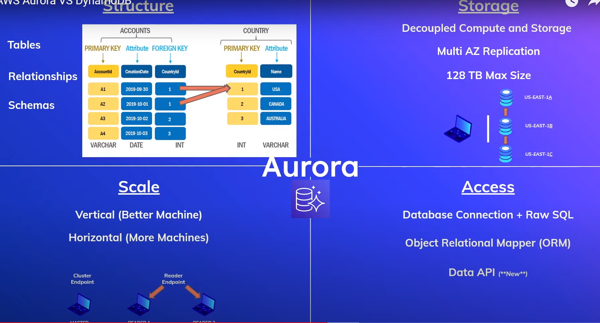
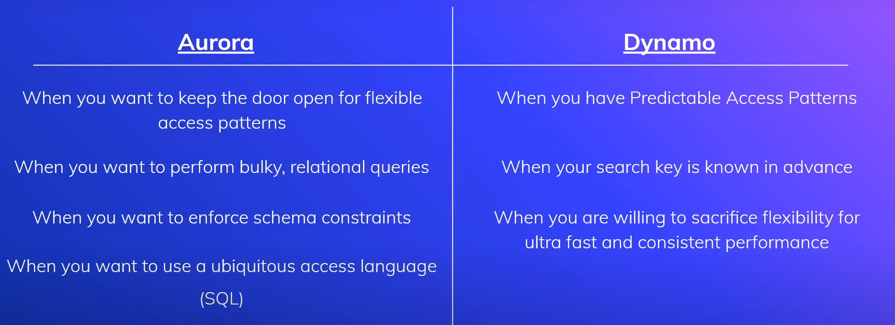

<h1> AWS Aurora </h1>

### What is RDS and Aurora ?

- RDS ( Relational Database Service ) : Simplifying the use of databases by taking away the hurdle of handling hardware, provisioning, backups, setup, patching, storage, auto-scaling and more...
- RDS is similar to running a MySQL database on EC2

- Aurora is a database engine option optimized for the cloud.
- Aurora is compatible with both MySQL and Postgres.
- Some pros of Aurora according to AWS like :
  - High Performance
  - High Availability
  - Automatic Backup
  - Serverless option
- When choosing Aurora AWS as your RDS you also need to specify whether or not you want MySQL or Postgres or Serverless supports.

### Four aspects of Aurora ( Structure, Storage, Scale, Access ):

- Structure : Consist of Tables, Every table has a primary key / attributes / foreign key. Foreign key is used to make a relation with another table.
- Storage : Decoupled Compute and Storage, Multi AZ Replication ( Copy data changes to different availability zones ), 128 TB MaxSize
- Scale : Vertical and Horizontal Scale
- Access :
  - Database Connection + Raw SQL
  - Object Relational Mapper ( ORM )
  - Data API ( New )

### Aurora vs DynamoDB When to use :

