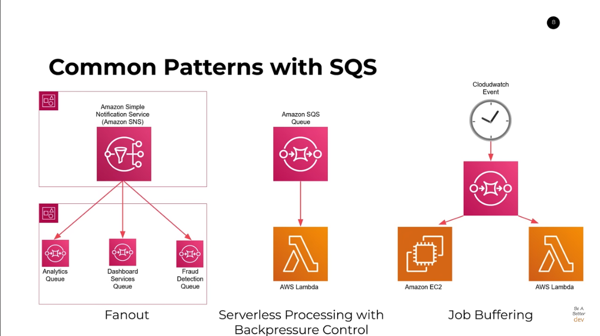

<h2>1.AWS SQS ?</h2>

### Introduction :

- Simple Queue Service ( 2006 )
- Allow you to send/store/receive messages between software components without losing messages or requiring other services to be available
- Pros: Scalable, Cost effective, Fully Managed and Highly Available

### Core Concepts :

- Queue : First in First out of messages, messages in the form of JSON
- Publisher / Producer : Adding messages into the queue
- Processor / Consumer : Receiving message and remove that message from the queue

### Message Processing Workflow :

- Firstly, A message is published to the queue

- Secondly, Message is claimed by receiver and visibility timeout countdown starts

- Afther that there are 2 Scenarios :
  - Message is processed and deleted by consumer
  - Visibility timeout expires and message go back into the queue

### Benefits of using SQS compared to API calls

- **Backpressure Control** Consumers can choose the rate of processing messages
- **Fire and Forget** Publishers have no insight into client processing
- **Eventual Guranteed Processing** Great for async or non-realtime apps
- **Application Decoulpling** Decouple service dependencies

- Because SQS is highly scalable and available, the chance of SQS goes down is slim to non compared to API Backend which can go down simply for wrong deployment. In the event if the service A want to send a request to service B. If service B is an API BackEnd and if it goes down for some reasons, service A has to wait for service B to be fixed before it can send message to service B again which is really bad for some businesses. But if we use SQS queue then all the messages of service A can still be sent to service B and sit waiting in the queue for service B to be fixed then when service B comes up, it can start processing messages in the queue.

### Types of Queues in SQS

- Standard Queue:
  - Best effort ordering ( Orders are not guaranteed )
  - At least one delivery ( May process the same message twice )
  - Unlimited Throughput ( unlimited publish rates and processing rates )
- FIFO Queue:
  - First in first out ordering
  - Exactly one processing
  - 300 Transaction per second MAX ( Basically saying there is a limit on how much they can process per second )
  - Slightly more expensive compared to Standard Queue

### Common Pattern with SQS

### Important details about SQS

- **Many threads / processes can poll a queue** at once
- Only a single thread can **process a message at once** ( visibility timeout )
- **Long polling** is supported and encouraged. Long polling means it can look up the message in the queue for the first time and if the message is not there, the request can stay open as long as it needs to wait for the message to be in the queue
- **256 KB** is the maximum payload size per message
- **Dead Letter Queues** can help store failed messages after a certain number of re-try

<h2>2.SQS FIFO queue ?</h2>

https://www.youtube.com/watch?v=cl_5dGGeTmY

### Advantages :

- Guranteed in order processing. This is very important for a certain businesses like buying flight ticket system, GPS tracking system, E-Commerce Applications
- Preventing duplicated messages

### Key Concepts :

- De-duplication :

  - Content based hashing : Messages with the same payload are discarded
  - Message de-duplication id : Mesasages with the same id are discarded

- Grouping : Label messages with ID ensures messages with the same ID are always processed in order

### Limits :

- Default : 300 calls per second per api, 3000 with batching
- High Throughput Mode : Region dependent, 6000 calls per second per api, 60000 with batching BUT requires messages groups

<h2>3.Lambda and SQS ?</h2>

- To prevent errors happening at scale, **Lambda throttle functions scaling when invocation errors occur**. When the errors are resolved, Lambda continues to scale the function.

-
